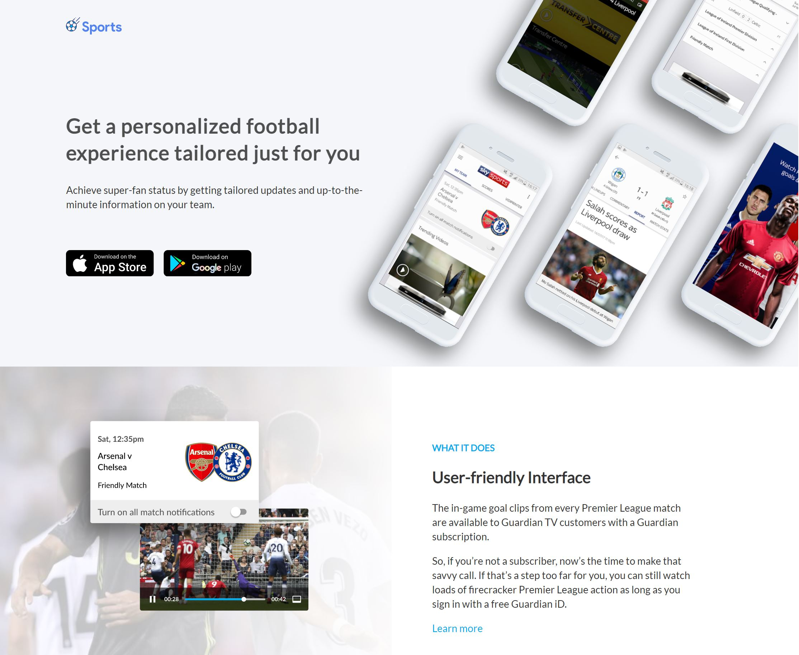

# Responsive Landing Page
Responsive landing page for desktop and mobile screen

## Table of contents
* [General info](#general-info)
* [Demo & Screenshot](#demo)
* [Technologies](#technologies)

## General info

This is an example of a responsive landing page. The screen sizes used to this exercise are max-width 1440px and a mobile size of 360px. To do this I used media queries and I have split the css file into more files to try to have more reusability of the code and readability. The main points are :

- Learn HTML and CSS
- Learn how to use flexbox position and media query

I created a dynamic slideshow with javascript.

## Demo & Screenshot

If you want to look the site click the [link](https://sportsresponsivelandingpage.netlify.app/)

## Technologies

- HTML
- CSS
- Javascript
